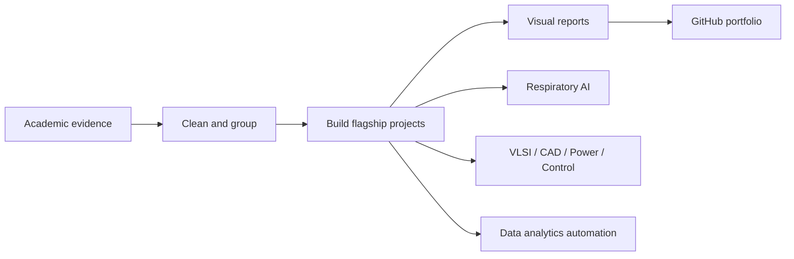

# Sowrav Chowdhury Academic and Data Portfolio

This repository is a curated, GitHub-ready portfolio package for Sowrav Chowdhury, built locally from existing academic/professional files plus Gmail and Google Drive evidence connected to `sowrav.chowdhury.eee@ulab.edu.bd`.

## Profile

Sowrav Chowdhury is an Electrical and Electronic Engineering graduate from the University of Liberal Arts Bangladesh with Cum Laude distinction and CGPA 3.77/4.00. His strongest technical identity is at the intersection of biomedical signal processing, low-cost embedded health devices, respiratory sound AI, and healthcare operations analytics.

Current professional direction:

- Squad Lead / clinical documentation operations experience at Augmedix.
- Research background in low-cost digital stethoscope systems, pediatric lung-sound collection, Raspberry Pi hardware integration, and 1D-CNN pneumonia diagnosis support.
- Data analyst portfolio direction using SQL/reporting, CSV analysis, dashboard assets, workflow KPIs, SLA monitoring, and automation.
- Academic writing and graduate-school positioning around biomedical AI, Data Science, Engineering, and trustworthy clinical AI.

## Repository Map

- `00_profile_and_credentials/`  
  CV, results, research-fit profiles, and identity documents for scholarship, graduate, and professional screening.

- `01_respiratory_ai_and_digital_stethoscope/`  
  Core research portfolio: digital stethoscope, pediatric pneumonia diagnosis, respiratory sound quality, RIP literature review, ICT Innovation Fund materials, IRB/progress/project evidence.

- `02_embedded_systems_and_control_projects/`  
  Microcontroller aquaculture, PID/control systems, digital filters, power electronics, and engineering project evidence.

- `03_lab_coursework_and_google_classroom/`  
  Capstone/coursework materials and Gmail/Classroom evidence showing ULAB lab/course activity.

- `04_data_analytics_and_ai_automation/`  
  Data analyst and AI automation assets: SLA analytics, Retool-style reporting data, Gemini computer-use automation, dashboard/project READMEs, and application analytics.

- `05_latex_academic_writing_and_reports/`  
  LaTeX/report-writing samples, graduate scouting reports, long-form academic writing, and polished PDF outputs.

- `99_evidence_inventory/`  
  Local file manifest, Gmail/Drive/Classroom analysis, GitHub upload notes, and recommended next upgrades.

## Created Portfolio Projects

Start with these project folders:

- `01_respiratory_ai_and_digital_stethoscope/portfolio_project_biomedical_respiratory_ai/`  
  Flagship biomedical AI research project: lung-sound acquisition, signal processing, model evaluation, and healthcare AI framing.

- `02_embedded_systems_and_control_projects/portfolio_project_vlsi_logic_gate_design/`  
  VLSI case study with CMOS logic, truth tables, layout/schematic evidence, and master's-level documentation direction.

- `02_embedded_systems_and_control_projects/portfolio_project_electrical_services_design_cad/`  
  CAD/design portfolio project using floor plan, electrical services drawings, load estimation, and design assumptions.

- `02_embedded_systems_and_control_projects/portfolio_project_power_systems_simulation/`  
  Power-system lab analysis project for formulas, plots, reports, and reproducible analysis notebooks.

- `02_embedded_systems_and_control_projects/portfolio_project_control_systems_modeling/`  
  Control-systems modeling project for transfer functions, step response, stability, and performance metrics.

- `04_data_analytics_and_ai_automation/portfolio_project_academic_archive_automation/`  
  Data automation project showing archive extraction, duplicate cleanup, course summaries, and portfolio intelligence.

## Visual Showcase

The repository now includes a modern visual layer for reviewers:

- Live website: `index.html`
- Visual report: `reports/portfolio_showcase_report.html`
- Shareable showcase PDF: `reports/Sowrav_Chowdhury_Flagship_Project_Showcase.pdf`
- Markdown showcase report: `reports/FLAGSHIP_PROJECT_SHOWCASE.md`
- Project one-pagers: `reports/PROJECT_ONE_PAGERS.md`
- Flagship system diagram: `site_assets/diagrams/respiratory_ai_system.svg`
- Project map: `site_assets/diagrams/portfolio_project_map.svg`
- Evidence pipeline: `site_assets/diagrams/archive_to_portfolio_pipeline.svg`

## Strongest Portfolio Story

The strongest GitHub narrative is:

1. Biomedical AI research: low-cost respiratory sound collection and 1D-CNN classification.
2. Embedded systems: Raspberry Pi, Arduino, sensors, control systems, and applied EEE projects.
3. Data analytics: clinical operations data, SLA reporting, dashboard-ready CSVs, and workflow analysis.
4. Graduate readiness: documented publications, research drafts, reports, LaTeX, and supervisor-facing research roadmaps.

## Privacy Note

This package is safe to upload as a private GitHub repository first. Before making anything public, review all PDFs/DOCX files for personal phone numbers, signatures, hospital names, patient-related material, institutional forms, or unpublished manuscript content.
