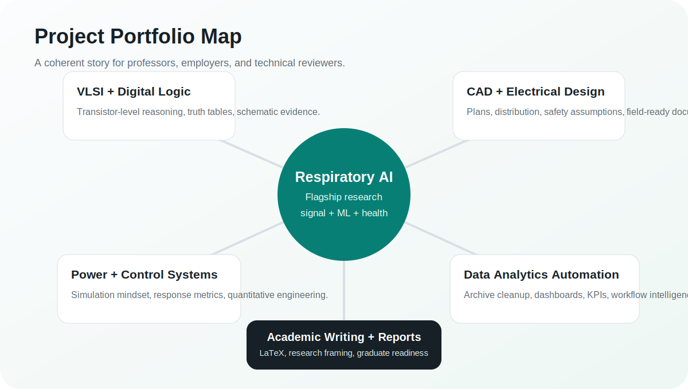
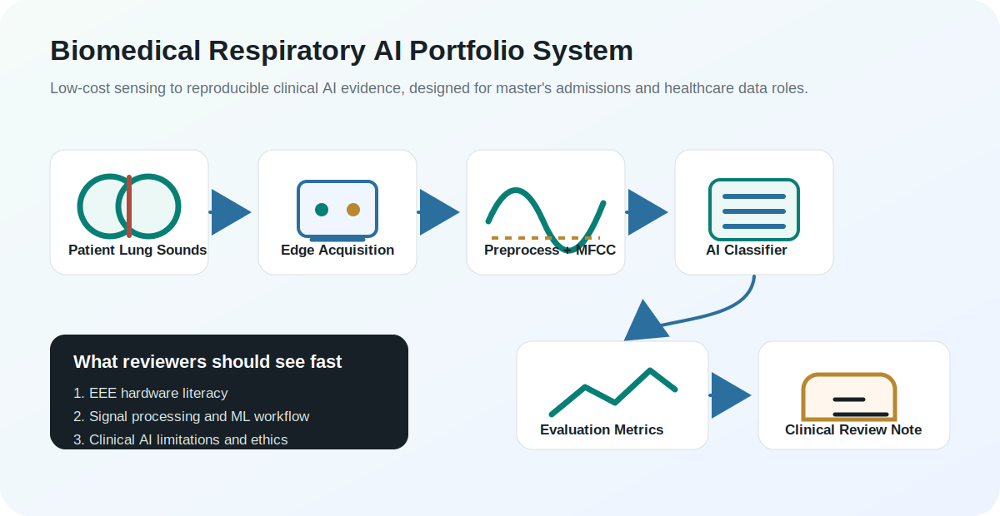
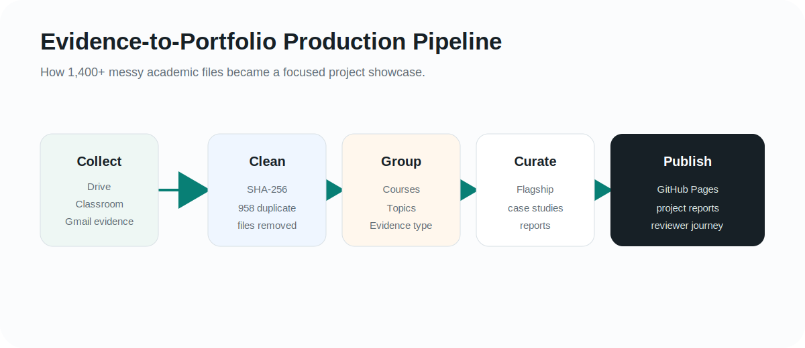
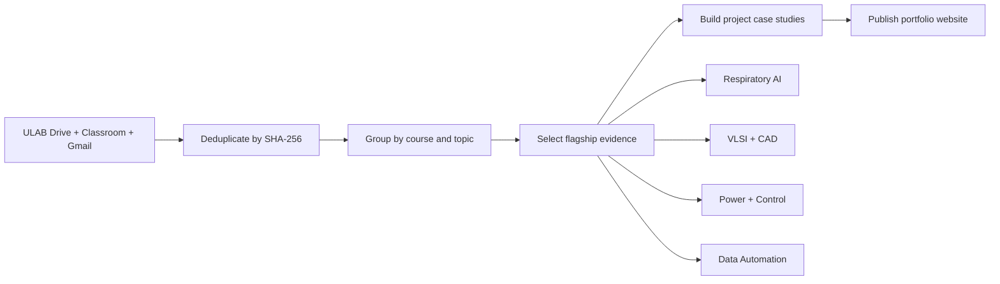

# Flagship Project Showcase Report

This report turns the portfolio from a file archive into a reviewer-friendly project narrative. It is written for graduate admissions committees, professors, and employers who need to understand the value of Sowrav Chowdhury's work quickly.

## Executive Positioning

Sowrav's strongest portfolio story is the intersection of electrical engineering, healthcare AI, and data automation:

- Biomedical respiratory AI as the flagship research direction.
- Embedded and electrical systems as the engineering foundation.
- Operations analytics and archive automation as the data analyst proof.
- LaTeX, reports, and research drafts as evidence of graduate-level communication.

## Portfolio System Map

## Flagship Architecture

## Evidence-to-Portfolio Pipeline

## Mermaid Version For GitHub Readers

## Reviewer Journey

1. Start with the live homepage to understand the technical identity.
2. Open the respiratory AI project first because it is the strongest admissions and research signal.
3. Review VLSI, CAD, power, and control projects as engineering depth.
4. Review the academic archive automation project as a data analytics and automation proof.
5. Use the PDF and evidence inventory only when deeper verification is needed.

## Modern Additions To Keep Building

- Add screenshots extracted from CAD/VLSI tools so reviewers can inspect work visually.
- Add a demo notebook for respiratory audio features using safe synthetic or public sample data.
- Add a model card for the respiratory AI classifier.
- Add a one-page ethics and deployment note for clinical AI use.
- Add recruiter-facing screenshots to the homepage as each project matures.
